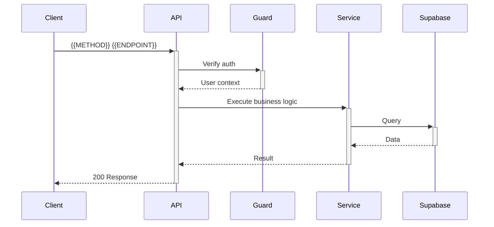

# Design Document (API-Only) — Route Handler

> Sử dụng khi chỉ thêm/chỉnh sửa API route (không UI, không service layer phức tạp).

## Overview
**Endpoint**: `{{METHOD}} {{ENDPOINT}}`
**Purpose**: {{PURPOSE}}
**Auth**: {{AUTH_REQUIREMENT}}

## Boundary
### Owns
- {{OWNS_1}}

### Out of Boundary
- {{OUT_OF_BOUNDARY_1}}

## Request Contract
```typescript
// Request
interface {{REQUEST_NAME}} {
  {{FIELD_1}}: {{TYPE_1}};
  {{FIELD_2}}: {{TYPE_2}};
}

// Query params (nếu có)
interface {{QUERY_NAME}} {
  {{PARAM_1}}: {{TYPE_1}};
}
```

## Response Contract
```typescript
// 200 Success
interface {{RESPONSE_NAME}} {
  data: {{DATA_TYPE}};
  meta?: {
    total: number;
    page: number;
  };
}

// Error
interface {{ERROR_NAME}} {
  error: {
    code: string;
    message: string;
    details?: Array<{ field: string; message: string }>;
  };
}
```

## Validation (Zod Schema)
```typescript
const {{SCHEMA_NAME}} = z.object({
  {{FIELD_1}}: z.{{VALIDATOR_1}},
  {{FIELD_2}}: z.{{VALIDATOR_2}},
});
```

## File Layout
```
app/api/{{ROUTE_PATH}}/route.ts          # Handler
lib/api/{{DOMAIN}}-guard.ts               # Auth/role guard (nếu có)
services/{{DOMAIN}}.service.ts            # Business logic
__tests__/app/api/{{ROUTE_NAME}}.test.ts  # Tests
```

## Flow


## Status Codes
- `200` — {{CASE_200}}
- `400` — {{CASE_400}}
- `401` — {{CASE_401}}
- `403` — {{CASE_403}}
- `500` — {{CASE_500}}

## Testing
- [ ] Valid request returns 200
- [ ] Missing auth returns 401
- [ ] Invalid input returns 400 with field details
- [ ] Non-existent resource returns 404
- [ ] Server error returns 500 without leaking details
