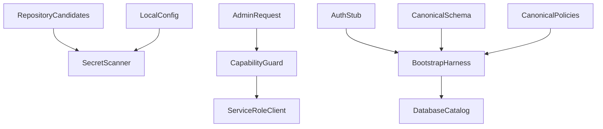

# Tai lieu thiet ke

## Tong quan

Thiet ke nay thu hep ba duong dac quyen co muc Critical ma khong mo rong sang cac phat hien High/Medium. Thay doi duoc chia thanh ba boundary doc lap: Secret Containment, Privileged Authorization va Supabase Bootstrap. Moi boundary co test hoi quy rieng, sau do duoc xac minh bang full suite, typecheck va build.

### Muc tieu

- Loai credential dac quyen khoi tep setup va Docker build context.
- Chi full admin duoc thay doi role, khong lam mat workflow support/moderator cho thao tac khac.
- Bao dam schema/policy canonical co the khoi tao database moi ma khong bo sot RLS.

### Khong phai muc tieu

- Khong xoay key tren Supabase tu xa.
- Khong sua PayOS, Premium entitlement, telemetry, rate limiting hoac error disclosure.
- Khong tu dong apply migration len production.

## Boundary Commitments

### Spec nay so huu

- Ignore/redaction contract cho local secret va Docker context.
- Authorization contract cho single va bulk role mutation.
- Canonical schema/RLS coverage contract va validation test.

### Ngoai boundary

- Vong doi key tren Supabase dashboard/platform.
- Tat ca admin capability khong thay doi role.
- Data migration production va rollback tu xa.

### Dependency duoc phep

- Next.js route handlers va error types hien huu.
- Supabase query client hien huu.
- Jest, Node filesystem API va cac SQL file hien huu.
- Docker CLI va official `postgres:16-alpine` image cho empty-database bootstrap verification.

### Trigger can revalidation

- Them table public moi hoac doi ten table/policy.
- Them role nhan su moi hoac capability moi cho admin routes.
- Thay doi Docker build context hay cach nap environment.

## Kien truc

### Phan tich he thong hien huu

- `canAccessAdmin` hien dien ta quyen vao admin workspace, khong du phan giai capability mutation.
- `requireAdmin` vua xac thuc role vua cap service-role client.
- `schema.sql` duoc ghi chu la canonical bootstrap nhung bi rut gon, trong khi `policies.sql` gia dinh cac bang day du.

### Boundary map



Dependency direction: tests phu thuoc vao contract tep/config; route phu thuoc vao guard; guard phu thuoc vao auth va server client. Config va SQL khong phu thuoc vao route/UI.

### Technology stack

| Layer | Lua chon | Vai tro |
|---|---|---|
| Backend | Next.js 15 route handlers | Admin authorization |
| Data | PostgreSQL/Supabase SQL | Canonical schema va RLS |
| Test | Jest 30 | Security regression checks |
| Runtime | Docker multi-stage | Build-context containment |
| Validation runtime | PostgreSQL 16 container | Execute empty-database bootstrap |

## File Structure Plan

### Tep sua

- `.gitignore` - ngan local setup credential bi stage.
- `.dockerignore` - loai moi `.env*` va local setup file khoi build context.
- `setup_docker.txt` - chi giu huong dan dung environment placeholder.
- `package.json` - cung cap lenh secret scan va executable bootstrap verification.
- `lib/admin.ts` - phan biet admin access va role-management capability.
- `lib/api/admin-guard.ts` - cung cap full-admin guard truoc khi tao service-role client.
- `app/api/admin/users/[id]/route.ts` - chon guard theo field mutation va partial update an toan.
- `app/api/admin/bulk-actions/route.ts` - dung full-admin guard cho bulk role mutation.
- `supabase/schema.sql` - canonical schema day du, khong placeholder omission.
- `supabase/policies.sql` - RLS cho moi canonical public table, gom `user_goals`.

### Tep test

- `tools/security/scan-repository-secrets.mjs` - scan tracked va non-ignored untracked candidates ma khong doc ignored runtime env files.
- `tools/security/verify-supabase-bootstrap.mjs` - khoi dong PostgreSQL container, apply SQL voi `ON_ERROR_STOP`, va query catalog.
- `tools/security/supabase-auth-stub.sql` - tao roles, `auth.users` va `auth.uid()` toi thieu cho bootstrap test.
- `__tests__/security/secret-containment.test.ts` - scanner va ignore invariants.
- `__tests__/app/api/admin-role-authorization.test.ts` - single/bulk role authorization va partial update.
- `__tests__/security/supabase-bootstrap.test.ts` - static table/RLS invariants va wrapper cho execution harness khi Docker san sang.

## Requirements Traceability

| Requirement | Tom tat | Component | Validation |
|---|---|---|---|
| 1.1, 1.2, 1.3, 1.4 | Secret containment | Secret Containment | Repository candidate scan |
| 2.1, 2.2, 2.3, 2.4, 2.5 | Role mutation | Privileged Authorization | Route/guard tests |
| 3.1, 3.2, 3.3, 3.4, 3.5 | Secure bootstrap | Supabase Bootstrap | Empty PostgreSQL execution and catalog checks |
| 4.1, 4.2, 4.3 | Completion evidence | Validation Gate | Test/typecheck/build/manual gaps |

## Components va Interfaces

### Secret Containment

**Trach nhiem**

- Khong cho credential literal nam trong setup guide.
- Loai local secret files khoi Git va Docker contexts.
- Liet ke candidates bang `git ls-files --cached --others --exclude-standard`, scan literal secret shapes, va kiem tra Docker ignore bao phu runtime env/local setup.
- Fixture test khong duoc chua mot credential hoan chinh; pattern phai duoc ghep tu cac fragment.

### Privileged Authorization

**Contract**

```typescript
type AdminRole = "admin" | "moderator" | "support" | "user";

function canAccessAdmin(role: string | null | undefined): boolean;
function canManageUserRoles(role: string | null | undefined): role is "admin";
function requireFullAdmin(request: Request): Promise<AdminContext>;
```

**Invariant**

- Service-role client cho role mutation chi duoc tao sau khi role hien tai la `admin`.
- Update chi ghi cac field hop le co mat trong request.

### Supabase Bootstrap

**Contract**

- Moi `alter table public.X enable row level security` phai co `create table ... public.X` trong canonical schema.
- Moi table public trong canonical schema phai co RLS entry trong canonical policies.
- `user_goals` phai co owner-scoped CRUD policies.

**Execution Harness**

1. Xac minh Docker CLI va PostgreSQL image san sang.
2. Tao container tam thoi khong publish port ra host.
3. Apply Supabase auth stub, canonical schema va canonical policies bang `psql -v ON_ERROR_STOP=1`.
4. Query `pg_class` va `pg_policy` de xac minh table/RLS/policy state that.
5. Luon xoa container trong cleanup path; neu runtime khong san sang, tra manual-verification status ro rang.

## Error Handling

- Role khong du tham quyen tra `ForbiddenError` va khong tao write query.
- Role input khong hop le tra validation error, khong coerce.
- Bootstrap validation hien thi ten table thieu schema hoac RLS de sua truc tiep.

## Testing Strategy

- **Unit**: capability helpers cho `admin`, `moderator`, `support`, `user`.
- **Route integration voi mock**: support/mod bi 403; admin duoc doi role; goal-only khong ghi role; bulk role dung full-admin guard.
- **Static SQL integration**: so khop nhanh tap table canonical va RLS target; cam placeholder omission; kiem tra `user_goals` policy.
- **Executable database integration**: apply auth stub, schema va policies vao PostgreSQL rong voi stop-on-error; query catalog de xac minh RLS.
- **Regression**: full Jest suite, TypeScript typecheck, Next production build.

## Security Considerations

- Khong in hoac dua credential cu vao patch/test output.
- Khong xem test pass la bang chung key da duoc rotate hoac live RLS da duoc apply.
- Khong cap service-role client truoc capability check trong role-mutation path.

## Migration Strategy

1. Khôi phuc canonical schema idempotent.
2. Ap dung canonical policies sau schema tren moi truong moi.
3. Chay static checks va empty-database bootstrap harness trong CI/local co Docker.
4. Doi chieu va apply migration phu hop len live Supabase theo lich su thuc te.
